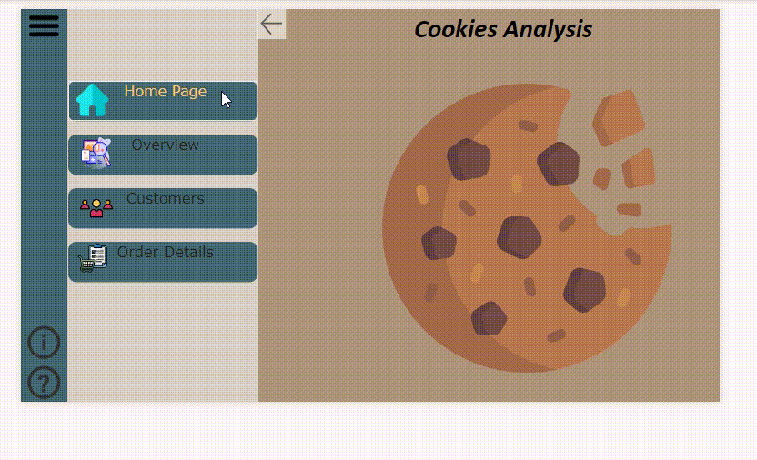
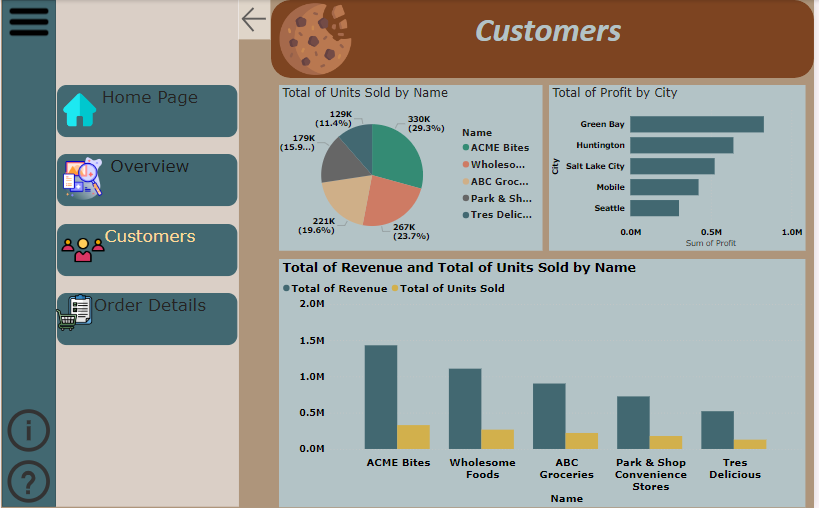
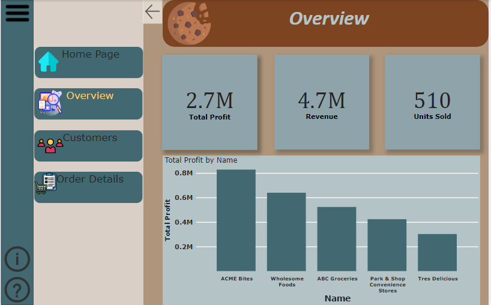
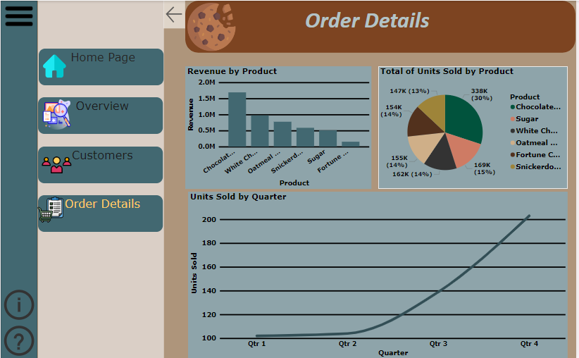

# PowerBI
Cookies Analysis

# 🍪 Cookies Shop Sales Report - Data Analysis with Power BI

Welcome to the **Cookies Shop Sales Report** project! This Power BI report provides deep insights into the sales performance of a Cookies Shop, including customer behavior, product performance, and a detailed model of sales data.

## 🗂️ Table of Contents
- [Project Overview](#project-overview)
- [Features](#features)
- [Report Tabs Overview](#report-tabs-overview)
  - [1. Customer Overview](#1-customer-overview)
  - [2. Product Overview](#2-product-overview)
  - [3. Sales Model Overview](#3-sales-model-overview)
- [Screenshots](#screenshots)
- [How to Use](#how-to-use)
- [Technologies Used](#technologies-used)

---

## 📋 Project Overview

This report was created using **Power BI** and covers data analysis of sales for a Cookies Shop. The report leverages multiple datasets to provide insights into customer demographics, product performance, and overall sales trends. The key goal of the report is to help stakeholders understand where to focus their efforts for improving customer engagement and boosting product sales.

---

## 🚀 Features
- **Interactive visualizations** for exploring sales performance by customer, product, and location.
- **DAX calculations** for advanced metrics like Total Revenue, Profit, and Units Sold.
- **Page Navigation** for smooth transitions between report tabs.
- **Custom Filters** to segment data by product type, customer demographics, and more.

---

## 📊 Report Tabs Overview

### 1. Customer Overview
Gain insights into customer demographics, purchase history, and customer segments.

Key metrics include:
- **Total Customers**
- **Units Sold by Customer**
- **Customer Segmentation**
- **Geographic Distribution of Customers**

---

### 2. Product Overview
Analyze the performance of various cookie products.

Key metrics include:
- **Total Revenue by Product**
- **Units Sold by Product**
- **Top-Selling Cookies**
- **Product Trends by Time**

---

### 3. Sales Model Overview
Explore the relationship between various factors such as time, location, and product type to understand sales trends.

Key metrics include:
- **Quarterly Sales Trends**
- **Sales by Location**
- **Total Profit Breakdown**
- **Sales Forecasts and Projections**

---

## 🛠️ How to Use

1. **Download the report** from this repository.
2. Open it in **Power BI Desktop**.
3. Interact with the visualizations by filtering data using slicers, clicking on charts, or navigating through the report tabs.
4. Export insights into **PDFs or PowerPoint** for presentations.

---

## 🧰 Technologies Used

- **Power BI**: Data modeling and interactive visualizations.
- **DAX**: For calculating Total Revenue, Profit, and other metrics.
- **Excel**: Data transformation and cleanup.
- **Power Query**: Data manipulation and transformation.

---

## 📂 Data Model

The data model consists of three main tables:
1. **Customers**: Information on customers and their purchase behavior.
2. **Products**: Detailed data on various cookie types sold in the shop.
3. **Transactions**: Records of sales, including transaction date, product ID, and customer ID.

---

## 🤝 Acknowledgements
- Special thanks to my instructor, **Alaa Essam**, for the guidance and support throughout this project.

---

## 📬 Contact

For more information, feel free to contact me at:
- **Email**: [Omar.M.Saleh.M@gmail.com](mailto:Omar.M.Saleh.M@gmail.com)
- **LinkedIn**: [linkedin.com/in/omar-saleh](https://www.linkedin.com/in/omar-saleh)
